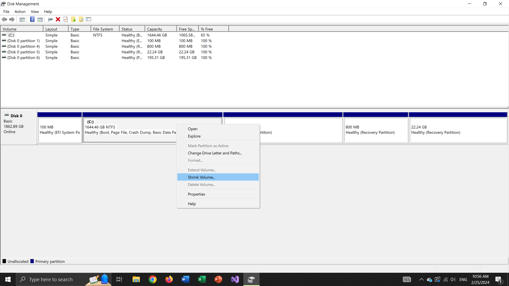
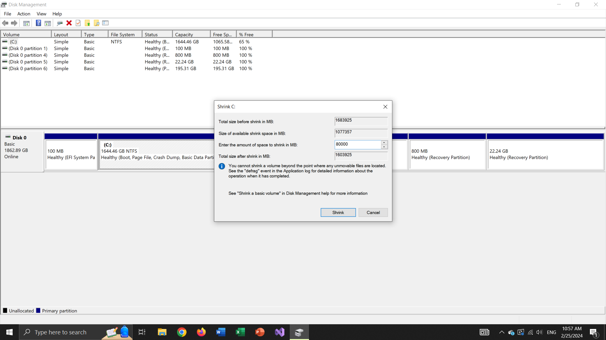
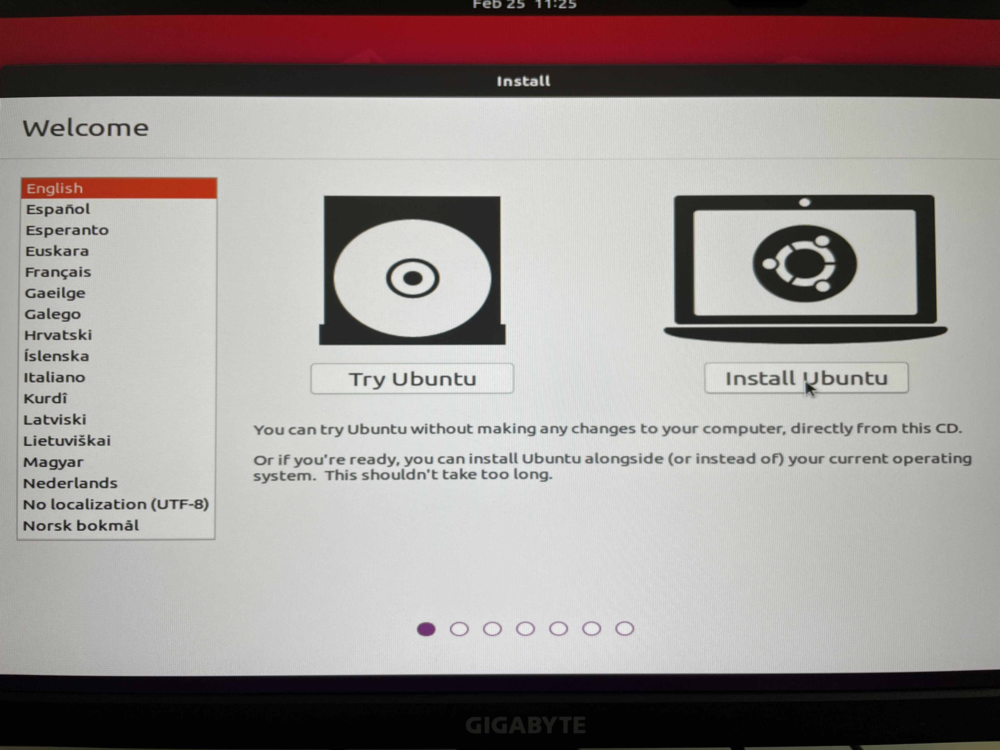
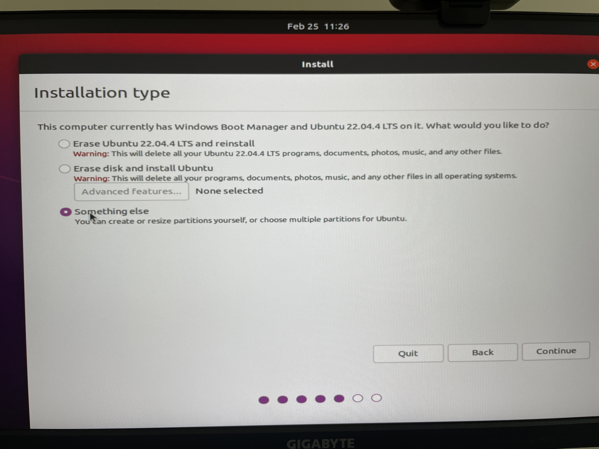

# Linux Tutorials


## Description

Unlike Windows, Unix family operating systems including Linux and BSD are open-source and free in addition to the focus on using the terminal instead of graphical user interfaces (UIs).

Linux is part of Unix OSs and Ubuntu is a debian-based distribution of Linux. Linux is to Windows what manual cars are to the automatic ones. It offers more security and low-level access to the hardware and I/Os which makes it preferable to developers. Windows updates and idiotic releases are a headache for everyone and there seems to be no promising solutions in the future. 

Working with Linux might seem a bit confusing and unnatural at first, but once you get hands on commands and features, you'll realize the benefits and perks of using a Unix-based OS for your system and development.


## Table of Contents

- [Introductions](#Introductions)
- [Usage](#usage)
- [Contributing](#contributing)
- [License](#license)

## Installations (Dual Boot on Windows)

Download Ubuntu desktop image file from [here](https://releases.ubuntu.com/focal/). Search "create and format hard disk partitions" on your Windows search bar. Right click on your C: volume and select shrink volume. 



Enter your desired space in MB and click OK.



Burn the Ubuntu 20 image on a USB with Rufus prefrably. Restart your Windows and keep pressing "Del" or "F11" to enter BIOS settings (the BIOS buttons might differ on your system). Once in BIOS settings, change the boot priority to USB and then save and reboot.

Click on "Install Ubuntu". Select your language and then choose "Normal Installation" on "Updates and other software" tab.



Over "Installation Type" tab select "something else".




 Click on "free space":

 

 Then click on + button. Type "/" for "Mount point" and then click ok and then install.

 


## Installations (Virtual Machine)


Download VMWare Workstation Player from the [official website](https://www.vmware.com/ca/products/workstation-player.html). Unlike VMWare Pro, this version is free but only allows one virtual machine.


Select the iso file, choose a username and password and then install the virtual machine.


## Usage

Open a terminal with:

```
Ctrl + Alt + T
```

For opening another terminal on the same page:

```
Ctrl + Shift + T
```

### Terminal


Here is a list of useful terminal commands:

```bash
$ ls # list current directory
```

```bash
$ ll # detailed directory listing
```

```bash
$ ls -l / # list root directory
```

```bash
$ pwd # display the path name of the working directory
```

```bash
$ cd  # change direcotry
```

```bash
$ mkdir # make a directory
```

```bash
$ mv # move a file or directory
```

### Shortkeys

Useful shortkeys on a terminal:


```
Ctrl + Shift + C (copy)
```

```
Ctrl + Shift + V (paste)
```

```
Ctrl + Shift + R (search for previous commands)
```

```
Ctrl + Shift + U (delete current command)
```

```
Ctrl + C (interrupt current process)
```

```
Ctrl + D (exit current terminal)
```


### File Editing


Create a file with:

```bash
$ touch example.txt
```

To edit use either:

```bash
$ gedit example.txt
```

Or:


```bash
$ vi example.txt
```


vi commands:

```
:qw (save and quit)
```

```
:q! (quit without saving)
```


## Python

The default python command on Ubuntu terminal is:

```bash
$ python3
```

To change it run:

```bash
$ sudo apt install python-is-python3
```

Now create a python file and run it:


```bash
$ touch hello.py
$ echo 'print("hello world")' > hello.py
$ chmod +x hello.py
$ python hello.py
```


### Pip


To install pip:


```bash
$ sudo apt install python3-pip
```

To list packages, run:

```bash
$ pip list
```

To install a package, like numpy, simply run:


```bash
$ pip install numpy
```

## C++

Developing and building C++ files are pretty chill on Linux. First you should install CMake:


```bash
$ sudo apt update
$ sudo apt install cmake
```

Make sure cmake is installed:


```bash
$ cmake --version
```

Now create a new foler in Documents directory:

```bash
$ cd /Documents
$ mkdir C++
```

Create a cpp file:

```bash
$ touch main.cpp
```

Write your code here:


```cpp
#include <iostream>

int main(int argc, char* argv[])
{
    std::cout << "Hello Linux! \n";
    return 0;
}
```

Now create your CMakeList.txt file:

```bash
$ touch CMakeLists.txt
```

And write:

```cmake
cmake_minimum_required(VERSION 3.16.3)

project(HELLOLINUX VERSION 1.0)

add_executable(${PROJECT_NAME} main.cpp)
```

### Compiled Assembly 

```
g++ -g -c -Wa,-alh main.cc > main.s
```

### Configure


Now you have to create configure.sh, build.sh and run.sh bash files:

```bash
$ touch configure.sh
```

No write the following commands into configure.sh:

```bash
#!/bin/sh

cmake -S . -B out/build
```

### Build

```bash
$ touch build.sh
```

No write the following commands into build.sh:

```bash
#!/bin/sh

cd out/build ; make
```

### Run

```bash
$ touch run.sh
```

No write the following commands into build.sh:

```bash
#!/bin/sh

cd out/build ; ./HELLOLINUX
```


Make bash files executable:

```bash
$ chmod +x configure.sh build.sh run.sh
```

Now run:

```bash
$ ./configure.sh
$ ./build.sh
$ ./run.sh
```

## Git

Setting up Git is crucial for organizing your codes and version control. To install Git:

```bash
$ sudo apt install git
```


To clone a repository, simply run:


```bash
$ git clone git@github.com:roboticswithamir/linux_tutorials.git
```

You cannot directly make changes to repositories where you don't have developer access. To do so, you have to fork a repository first and then clone the fork one. So, you can simply access this repo over [here](https://github.com/roboticswithamir/linux_tutorials/tree/main) and then click on fork. Now clone your forked repo in a new folder. Before committing your changes, you have to add your ssh key to your github or gitlab account. To do so, first generate a ssh key:

```bash
$ cd
$ ssh-keygen
```

Now read the key by running:

```bash
$ cat .ssh/id_rsa.pub 
```
Copy the key into your github account by going to settings/SSH and GPG keys and add click on "New ssh key" and copy your key there.

You can now make changes and add all files to git by:

```bash
$ git add .
```

Then make a commit:


```bash
$ git commit -m "Add main.c"
```

And push it:

```bash
$ git push
```

## SSH

SSH offers secure and reliable access to a remote linux station or even a local one as a virtual machine. With SSH, one can simply develop codes over a local IDE or code editor on a Windows or other OS. SSH is installed by default on Ubuntu, however, it's needed to install ssh server as:

```bash
$ sudo apt install openssh-server
```

Then run:


```bash
$ sudo service ssh start
$ sudo service ssh status
```
For establishing an ssh, you need to have your host IP address. Install net-tools package:


```bash
$ sudo apt install net-tools
```
And run:

```bash
$ ifconfig
```

Now you can SSH into your host by running the following command on your desired terminal on Windows shell or anywhere else:

```bash
$ ssh usename@ip
```


### SSH Proxy

```bash
ssh -J B C
```

```
ssh -o ProxyCommand='ssh -W %h:%p B' C
```

If you need this every time you ssh from A to C it can be useful to add an entry in your .ssh/config file looking like this (in recent versions):

```
Host target
    ProxyJump proxy@proxy_ip
    HostName target_ip
    User target_user
```

## Task Automation (Crontab)

To perform an automated task with crontab, use the following command to start editing the default crontab file:

```
crontab -e
```

To get a list of the current tasks:

```
crontab -l
```

Crontab command format:

```
# 0 0 * * * /home/user/automate.sh >> /home/user/log.txt
```

## Run as Root

To run a shell as root simply run:

```
sudo -i
```


## Conda

Setup the .bashrc to prevent conda from being activate in every shell, hwoever, activate easily by "activate conda".

```
# >>> conda initialize >>>
# !! Contents within this block are managed by 'conda init' !!
# __conda_setup="$('/home/$USER/miniconda3/bin/conda' 'shell.bash' 'hook' 2> /dev/null)"
# if [ $? -eq 0 ]; then
#     eval "$__conda_setup"
# else
#     if [ -f "/home/$USER/miniconda3/etc/profile.d/conda.sh" ]; then
#         . "/home/$USER/miniconda3/etc/profile.d/conda.sh"
#     else
#         export PATH="/home/$USER/miniconda3/bin:$PATH"
#     fi
# fi
# unset __conda_setup
# <<< conda initialize <<<

if [ -f "/home/$USER/miniconda3/etc/profile.d/conda.sh" ]; then
    . "/home/$USER/miniconda3/etc/profile.d/conda.sh"
else
    export PATH="/home/$USER/miniconda3/bin:$PATH"
fi
```

## VLC

```
sudo snap install vlc
sudo apt-get install ubuntu-restricted-extras
```

## Nvidia Driver

TODO


## CUDA Installation

TODO


## Installations
```bash
# Example installation steps
$ git clone https://github.com/username/project.git
$ cd project
$ npm install
```

Multiline example:
```javascript
function exampleFunction() 
{
    return 'Hello, World!';
}
```

```bash
# Example installation steps
$ sudo apt search
```
