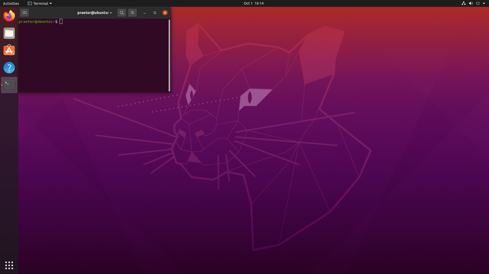

# Linux Tutorials



## Description

Unlike Windows, the Unix family operating systems including Linux and BSD are open-source and free in addition to the focus on using the terminal instead of graphical user interfaces (UIs).

Linux is part of Unix OSs and Ubuntu is a debian-based distribution of Linux. Linux is to Windows what manual cars are to the automatic ones. It offers more security and low-level access to the hardware and I/Os which makes it preferable to developers. Windows updates and idiotic releases are a headache for everyone and there seems to be no promising solutions in the future. 

Working with Linux might seem a bit confusing and unnatural at first, but once you get hands on commands and features, you'll realize the benefits and perks of using a Unix-based OS for your system and development.


## Table of Contents

- [Introductions](#Introductions)
- [Usage](#usage)
- [Contributing](#contributing)
- [License](#license)

## Installations

Download Ubuntu desktop image file from [here](https://releases.ubuntu.com/focal/). Now, download VMWare Workstation Player from the [official website](https://www.vmware.com/ca/products/workstation-player.html). Unlike VMWare Pro, this version is free but only allows one virtual machine.


```bash
# Example installation steps
$ git clone https://github.com/username/project.git
$ cd project
$ npm install
```

Multiline example:
```javascript
function exampleFunction() 
{
    return 'Hello, World!';
}
```
